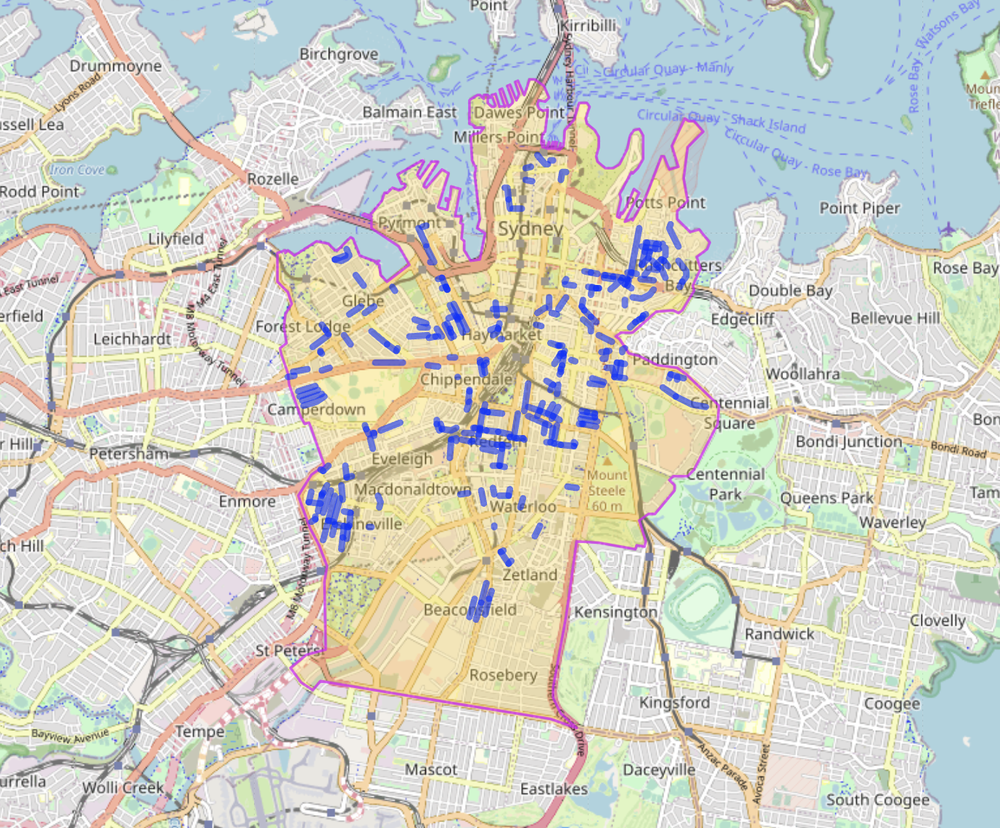

Draft Contraflow Streets, Sydney
================================

This document is a draft that may become a blog post at https://jakecoppinger.com in future.

# Current streets allowing bicycle contraflow

This is a map of the streets in the City of Sydney council area. The image is likely already out of date - click the link below to see the latest.



The query for this map is: https://overpass-turbo.eu/s/1wjm

```
[out:json][timeout:25];
(
  // Relation 1251066 is COS boundary:
  // https://www.openstreetmap.org/relation/1251066
  rel(1251066);map_to_area->.region;
  way["highway"]
  ["oneway:bicycle"="no"]
  (area.region);
);
out body;
>;
out skel qt;
```

# Street candidates that would make good contraflow streets
Work in progress. The following query finds roads in the City of Sydney that are:
- One way
- Do not currently allow bicycles to travel in the opposite direction
- Do not currently have a parallel separated cyelway

And excludes:
- Roads with more than 1 lane
- Dual carriageway one way roads
- Private roads
- Parking aisles, private or customer only roads
- Slip roads or highway links

Query: https://overpass-turbo.eu/s/1wl5

```
[out:json][timeout:25];
(
  // Relation 1251066 is COS boundary:
  // https://www.openstreetmap.org/relation/1251066
  rel(1251066);map_to_area->.region;
  
  // Select roads
  way["highway"]
  
  // Excluded under construction ways
  ["highway"!="construction"]
  // Excluded proposed ways
  ["highway"!="proposed"]
  
  // Only roads which are marked one way,
  // and don't allow bicycle contraflow
  ["oneway"="yes"]
  ["oneway:bicycle"!="no"]
  
  // Don't include roads that are bidirectional,
  // but are separated (and appear to be one way)
  ["dual_carriageway"!="yes"]
  
  // Don't include if a cycleway already present
  ["highway"!="cycleway"]
  
  // If a road is customers only it's likely
  // in a parking lot
  ["access"!="customers"]
  
  // Don't include roads where public access not allowed
  ["access"!="no"]
  
  // Don't include link roads (on ramps/slip roads)
  ["highway"!="motorway_link"]
  ["highway"!="primary_link"]
  ["highway"!="secondary_link"]
  ["highway"!="tertiary_link"]
  
  ["lanes"!=2]["lanes"!=3]
  ["lanes"!=4]
  ["access"!="private"]
  
  // Don't consider parking isles
  ["service"!="parking_aisle"]
  
  (area.region);
);
out body;
>;
out skel qt;
```


# Additional maps

- All mapped streets with contraflow allowed (including outside City of Sydney): https://overpass-turbo.eu/s/1wjl

Query:
```
[out:json][timeout:25];
(
  way["highway"]
 
  ["oneway:bicycle"="no"]
  
  ({{bbox}});
);
out body;
>;
out skel qt;
```